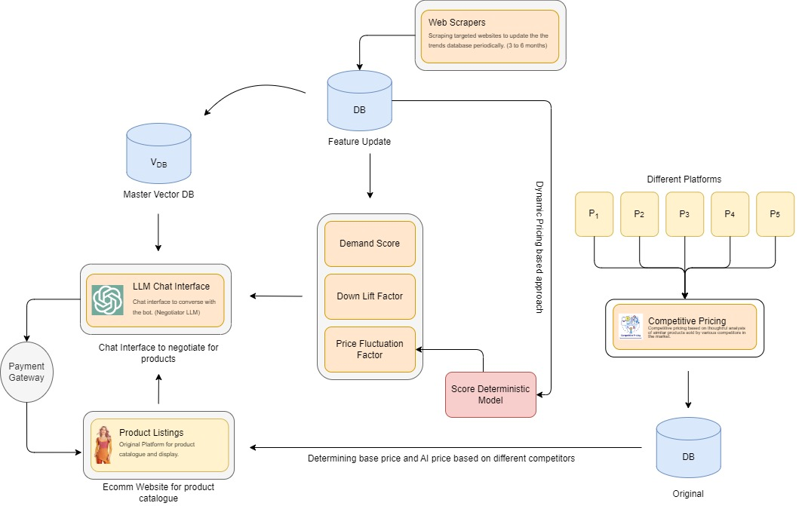
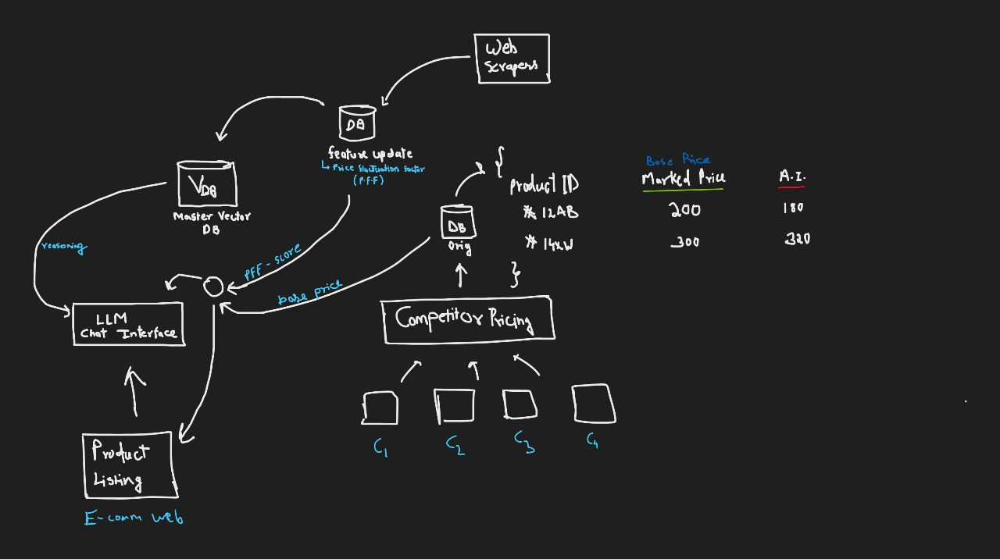

# LLM Negotiator

The LLM Negotiator project aims to enhance the e-commerce experience by integrating advanced language learning models (LLMs) to simulate personal interactions, enabling dynamic price negotiations, and providing increased transparency. This system addresses the limitations of fixed pricing and limited customer interaction, offering a more engaging and flexible shopping experience.

**Components and Workflow:**

Product Listings: The e-commerce platform displays product catalogs and interacts with the payment gateway for transactions.

LLM Chat Interface: This serves as the negotiation interface where customers can interact with an AI negotiator to discuss and negotiate product prices.

Master Vector DB (V_DB): Stores vector representations of negotiation data to enhance the LLM's understanding and response generation.

**Dynamic Pricing Model:**

Demand Score: Assesses product demand to adjust pricing dynamically.
Down Lift Factor: Determines the minimum allowable discount based on various factors.
Price Fluctuation Factor: Considers market trends and competitor pricing to adjust prices.
Competitive Pricing: Analyzes prices from different platforms (P1, P2, P3, P4, P5) and updates the pricing strategy to remain competitive.

Web Scrapers: Periodically scrape targeted websites to update the trends database (every 3 to 6 months), ensuring the pricing model is informed by current market conditions.

Score Deterministic Model: Utilizes inputs from the dynamic pricing model to determine a base price and AI-generated negotiation prices.

**Process Flow:**

Data Gathering and Update: Web scrapers collect market data, which updates the central database.

Competitive Analysis: The competitive pricing component analyzes data from various platforms and feeds it into the database.

Dynamic Pricing: The score deterministic model uses demand scores, down lift factors, and price fluctuation factors to dynamically adjust prices.
Customer Interaction: Through the LLM chat interface, customers negotiate prices in real-time. The LLM uses the master vector database to provide personalized and contextually relevant responses.

Transaction Completion: Once a price is agreed upon, the transaction proceeds through the payment gateway.

**Contributors**

1. [Prathamesh Parit](https://www.linkedin.com/in/prathameshparit/)
2. [Hrushikesh Kachgunde](https://www.linkedin.com/in/hrushikesh-kachgunde/)
